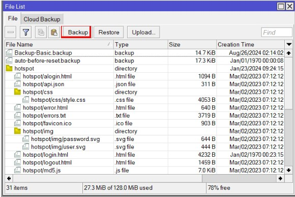
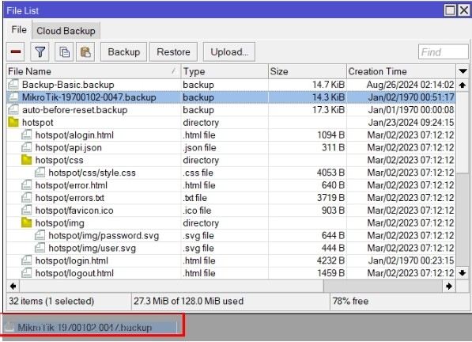
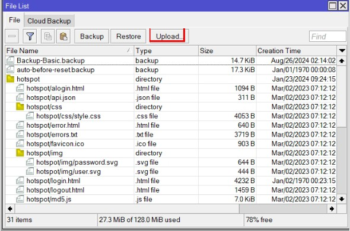
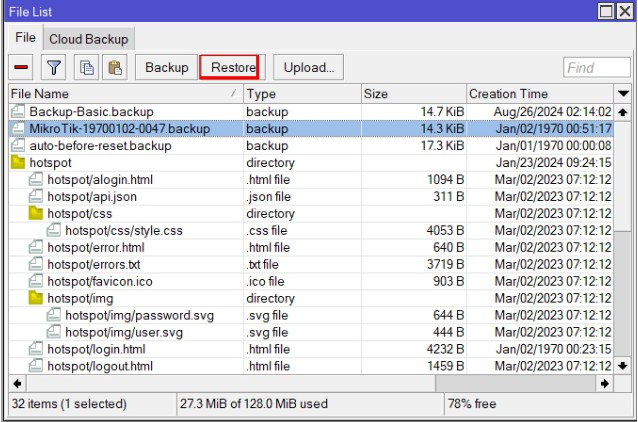
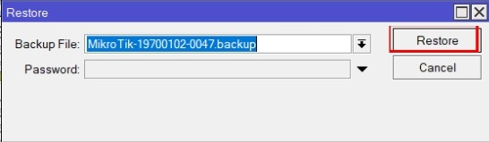

# Melakukan Backup dan Me-restore Konfigurasi pada MikroTik:
A. Backup konfigurasi MikroTik\
 1. Membackup konfigurasi\
  Buka tab Files > Backup

  
  Nama file backup akan digenerate secara otomatis oleh router berdasarkan tanggal dan jam backup dilakukan.\

  Jika ingin memberikan nama yang spesifik, diperlukan perintah backup melalui perintah teminal: / system backup save name="Nama file kustom"

    [admin@MikroTik] > system backup save name="Basic-Config"

 
 2. Memindahkan file backup ke direktori lokal\
Jika anda menggunakan Windows maka tinggal drag & drop saja file backup dari router ke direktori lokal

 

B. Restore konfigurasi ke MikroTik\
 1. Upload file backup ke penyimpanan router\
File > Upload > cari file backup yang akan direstore

 
 2. Me-restore file backup\
File > Plih file backup yang akan direstore > Restore

 
Setelah itu akan muncul tampilan seperti dibawah, lalu klik restore dan klik yes

 
Setelah itu MikroTik akan melakukan reboot 

# Kesimpulan
1. Untuk mencegah hal - hal yang tidak diinginkan, disarankan untuk selalu melakukan backup konfigurasi router secara berkala.\
2. Fitur backup dan restore hanya disarankan untuk router yang sama atau router dengan seri dan tipe yang identik.

Sekian yang dapat saya sampaikan, mohon maaf apabila ada salah kata atau kekurangan dalam penyampaian. Akhir kata, Wassalam. 
